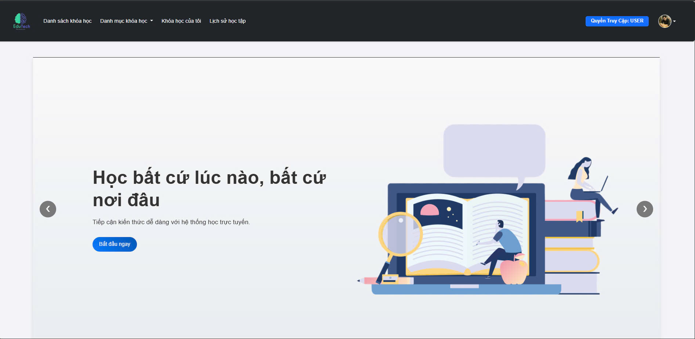
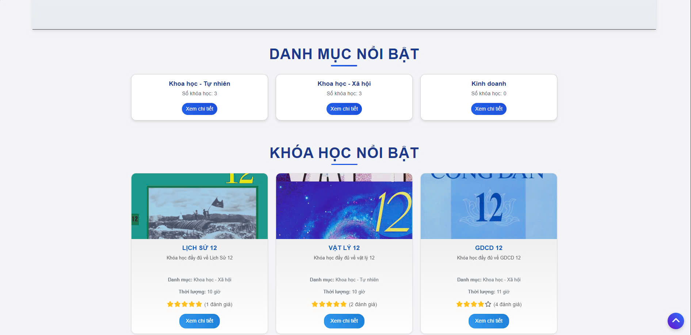

# Online Course Management System

This is an **Online Course Management System** built using **Java Spring Boot**. The system allows users to manage courses, lessons, quizzes, enrollments, and more. It also supports OAuth2 login and role-based authorization.

## Demo Application

### 🔐 Login Page


> Login screen with support for username/password and OAuth2 (e.g., Google login).

---

### 🏠 Home Page



> This is the landing page of the platform, showing featured courses and quick access to login or register.

---

### 📚 Course List


> A user-friendly interface where students can browse available courses.

---

### 📘 Course Details & Lessons


> Inside each course, users can view lessons, track their progress, and leave comments.

---

### 📝 Quiz Interface


> Students can take quizzes after lessons. The system auto-grades and records results.

---

### 📈 User Progress


> Users can monitor their own learning journey and achievements.

---

### 🏆 Course History


> Students can view a history of their enrolled courses and track their progress in each one.

---

### ✉️ Thank You Email


> After completing a course, students receive a thank you email, confirming their participation and achievements.

---

### 👤 Account Profile


> The account profile page allows users to manage their personal details, including email and password.

---

### 📚 Registered Courses


> View all the courses the student is currently enrolled in, with quick links to start the course or continue learning.

---

### 🎓 Completion Certificate


> After successfully finishing a course, students can download their course completion certificate.

---


## Features

- User registration & login (including OAuth2)
- Course & lesson management
- Quiz creation and participation
- Enrollment and progress tracking
- Role-based access control
- Comment & reply system

## Prerequisites

Before running the project, make sure you have:

- Java 21 or above installed
- Spring boot 3.3.4 or above installed
- **Laragon** (or any MySQL server running locally)
- MySQL Workbench, DBeaver, or phpMyAdmin (optional for DB access)

## How to Set Up and Run

### 1. Clone the Repository

```bash
git clone https://github.com/your-username/your-repo-name.git
cd your-repo-name/LMS
```
### 2. Run the project and Configure the Database

2.1. Create the Database

```sql
CREATE DATABASE lms_db CHARACTER SET utf8mb4 COLLATE utf8mb4_unicode_ci;
```

2.2. Create Roles

```sql
USE lms

INSERT INTO role (id, name) VALUES
(1, 'ADMIN'),
(2, 'USER');
```

2.3. Create an Admin Account

```sql
INSERT INTO user (id, email, name, password, username) VALUES
(1, 'admin@example.com', 'admin', '$2a$10$7kRZ8...encryptedPasswordHere...', 'admin01');

-- Assign admin role to the user
INSERT INTO user_roles (user_id, role_id) VALUES
(1, 1);
```

🔒 Note: The password must be BCrypt-encrypted. You can generate it using an online tool or Java code:

```java
new BCryptPasswordEncoder().encode("yourPassword")
```

### 3. Run the project and Configure the Database
Edit ```src/main/resources/application.properties``` and update the DB connection:

```properties
spring.datasource.url=jdbc:mysql://localhost:3306/lms
spring.datasource.username=${DB_username}
spring.datasource.password=${DB_password}
```

### 4. Build the Project

```bash
./mvnw clean install
```

Or on Windows:

```cmd
mvnw.cmd clean install
```

### 5. Run the Application

```bash
./mvnw spring-boot:run
```

Or:

```bash
java -jar target/LMS-0.0.1-SNAPSHOT.jar
```

Replace the JAR name if it differs.

### 6. Access the Application

Once running, open your browser:

```arduino
http://localhost:8080
```

You can now log in using the admin credentials you created.

### 7. Configure OAuth2 Login (Optional)

If you want to enable OAuth2 login (e.g. with Google), add the following configuration to your ```src/main/resources/application.properties:```

```properties
# OAuth2 Login Configuration
spring.security.oauth2.client.registration.google.client-id=YOUR_GOOGLE_CLIENT_ID
spring.security.oauth2.client.registration.google.client-secret=YOUR_GOOGLE_CLIENT_SECRET
spring.security.oauth2.client.registration.google.scope=profile,email

spring.security.oauth2.client.registration.google.redirect-uri={baseUrl}/login/oauth2/code/{registrationId}
spring.security.oauth2.client.registration.google.client-name=Google
```

### Troubleshooting

- Make sure your MySQL server is running (Laragon green light is ON).

- If port 8080 is busy, change the server port in application.properties:

```properties
server.port=8081
```
